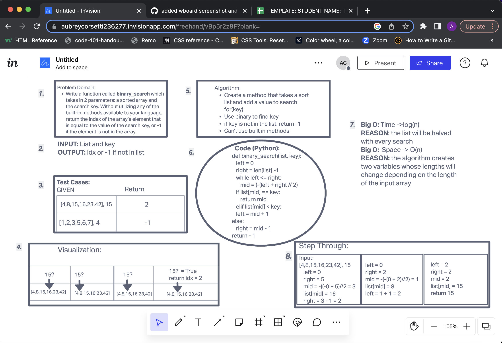

# Reverse an Array
<!-- Description of the challenge -->
Write a function called BinarySearch which takes in 2 parameters: a sorted array and the search key. Without utilizing any of the built-in methods in Python, return the index of the array’s element that is equal to the value of the search key, or -1 if the element is not in the array.
NOTE: The search algorithm used in your function should be a binary search.
Check the Resources section for details

## Whiteboard Process
<!-- Embedded whiteboard image -->

## Approach & Efficiency
<!-- What approach did you take? Discuss Why. What is the Big O space/time for this approach? -->
I created a function that used log time to search the list for the key value. I had to find the middle of the list and then create a loop that will search the list until the key was found. Once that happened I had to calculate the middle index. Then I set conditions on the left and right to limit the search. Then once the key value was found, it needed to be returned. If it wasn't found then it would return -1

click [here](../../README.md) to return home
