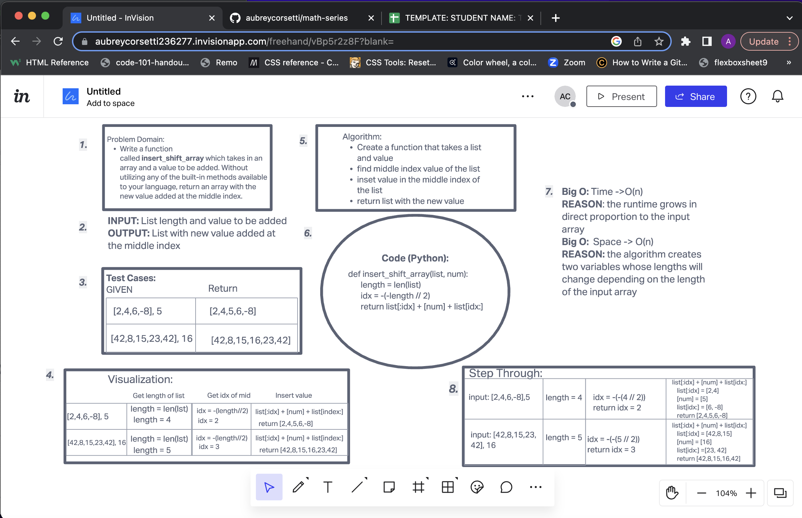

# Reverse an Array
<!-- Description of the challenge -->
Write a function called insertShiftArray which takes in an array and a value to be added. Without utilizing any of the built-in methods available to your language, return an array with the new value added at the middle index.

## Whiteboard Process
<!-- Embedded whiteboard image -->

## Approach & Efficiency
<!-- What approach did you take? Discuss Why. What is the Big O space/time for this approach? -->
I figured the easiest way to place something in the middle of a list would be splitting it in half, otherwise dividing it by 2 EX: // 2. I then concatinated the two new lists and put the new value in the middle. EX: list[ idx: ] + [ num ] + list[ idx: ]. For my Big O i used Time O(n) because since our input grows, our execution time does as well and Space O(n) because our list grows thus so does the memory to hold the variables for the length of our input list and input value
