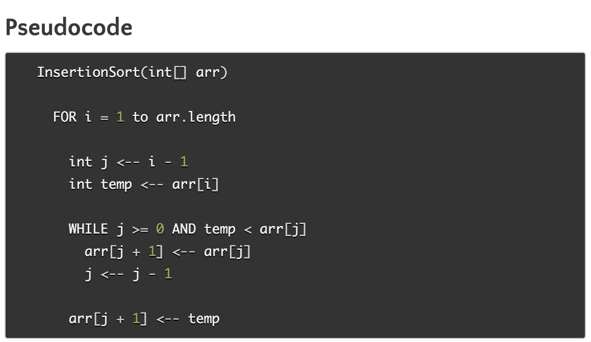
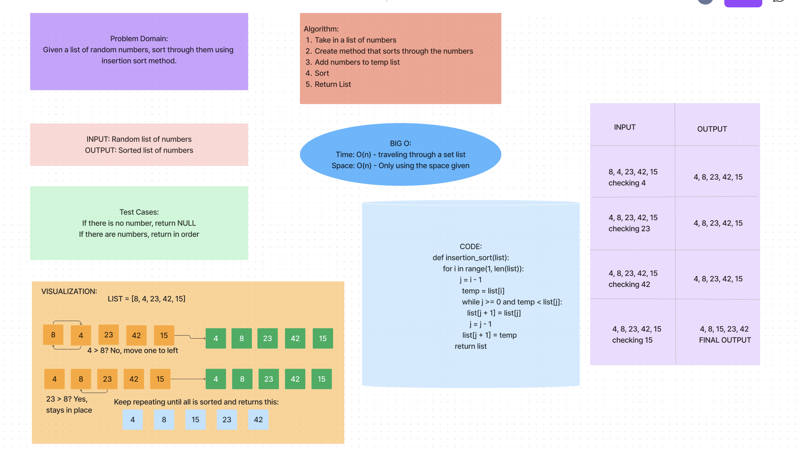

# Insertion/Sort
<!-- Description of the challenge -->
Review the pseudocode below, then trace the algorithm by stepping through the process with the provided sample array. Document your explanation by creating a blog article that shows the step-by-step output after each iteration through some sort of visual.

## Whiteboard Process
<!-- Embedded whiteboard image -->

## Approach & Efficiency
Big O for both time and space is O(n).

## Solution
pytest -k test_insertion_sort.py

click [here](../../README.md) to return home
