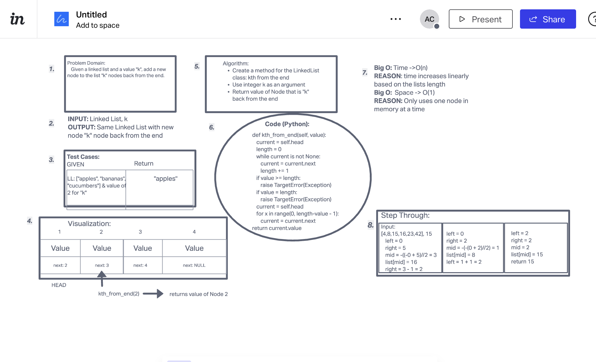

Kth from End

Using the LinkedList class we built for code challenge 5, create a new method to return the value of the node that is 'k' nodes back from the end of the list.

Whiteboard Process:

Approach:

Traverse through the linked list to find the length. Traverse through the nodes in the list again, length - 'k' times. Return the value of the node that is 'k' nodes back from the end of the list.

Link to code:

[here](../../data_structures/linked_list.py)

click [here](../../README.md) to return home
