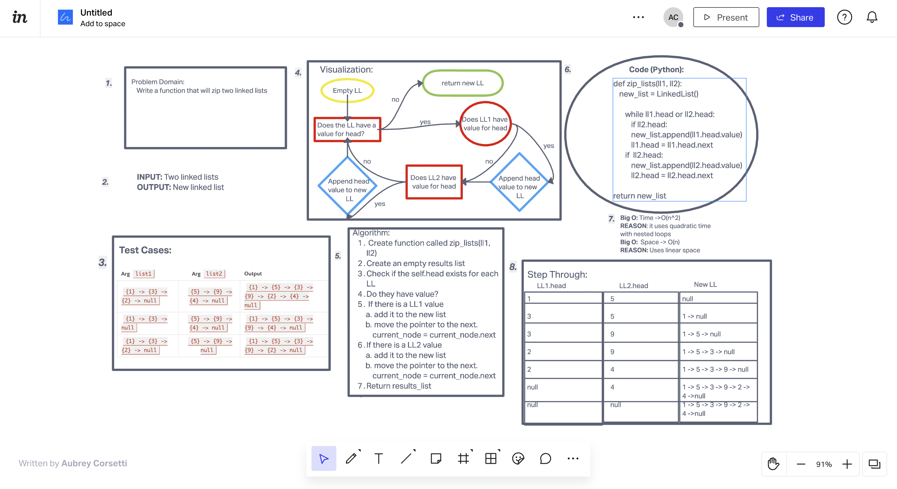

# Zip List
Write a function called zip lists
Arguments: 2 linked lists
Return: New Linked List, zipped as noted below
Zip the two linked lists together into one so that the nodes alternate between the two lists and return a reference to the zipped list.
Try and keep additional space down to O(1)
You have access to the Node class and all the properties on the Linked List class as well as the methods created in previous challenges.

## Whiteboard Process

## Approach & Efficiency
 Create function called zip_lists(ll1, ll2)
Create an empty results list
Check if the self.head exists for each LL
Do they have value?
 If there is a LL1 value
 add it to the new list
 move the pointer to the next. current_node = current_node.next
If there is a LL2 value
 add it to the new list
 move the pointer to the next. current_node = current_node.next
Return results_list
