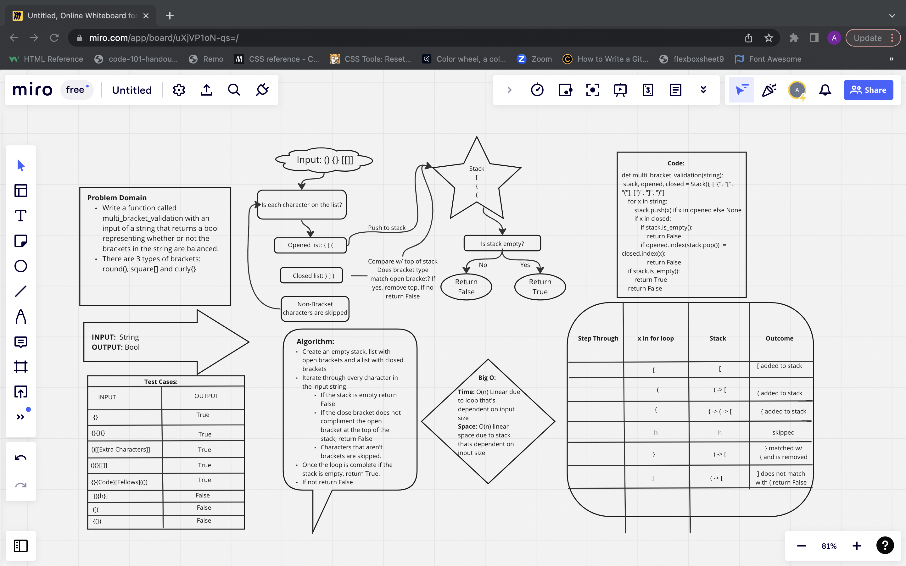

# Challenge
Write a function called validate brackets Arguments: string Return: boolean representing whether or not the brackets in the string are balanced There are 3 types of brackets:

Round Brackets : () Square Brackets : [] Curly Brackets : {}

# Approach and Efficiency
1. Take a string, iterate through the loop and find opened brackets
2. Add them to the list
3. Ignore whatever is not a bracket
4. When it finds a closing bracket match it with the one in the list
5. If the open and close brackets don't match return false

# Big O
Time O(n): is linear because of the loop used
Space O(n): because it will grow based on the input

# Contributors
Ricardo, Angelos and Jason

# Whiteboard

