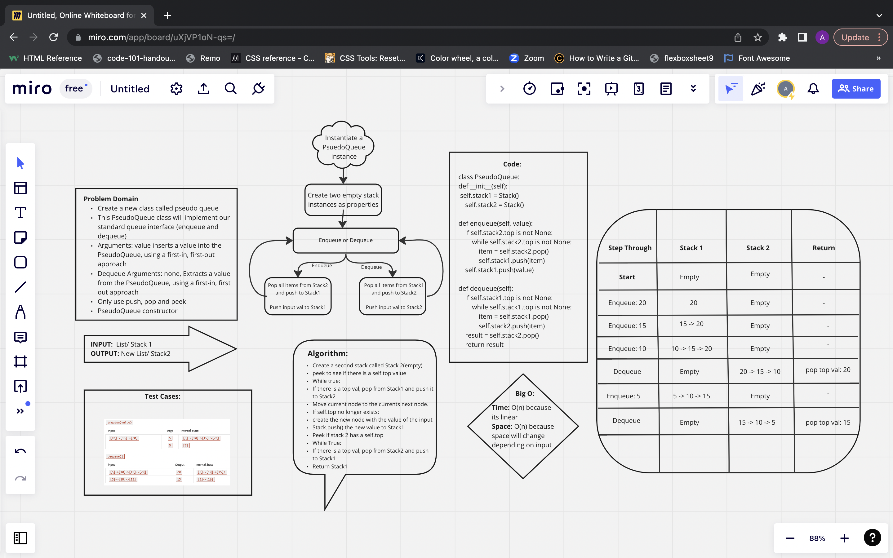

# Stacks Queues pseudo
use a class called PseudoQueue that will implement our standard queue interface. Only using what we created in the stack class and not the queue class.

# Challenge
Create a new class called pseudo queue.
Do not use an existing Queue.
Instead, this PseudoQueue class will implement our standard queue interface (the two methods listed below),
Internally, utilize 2 Stack instances to create and manage the queue
Approach & Efficiency
reading the instructions on canvas for this challenge.

# API
push adds a new node with that value to the top of the stack with an O(n) Time performance.

pop Returns: the value from node from the top of the stack Removes the node from the top of the stack Should raise exception when called on empty stack

# WhiteBoard

